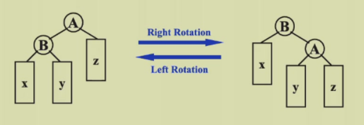

## ads  week 1

#### AVL Trees

##### Target

speed up searching, insert&query&delete are all $O(ln\space n)$ in one step

##### Tool

binary search trees

##### Balanced trees

- empty tree: height balanced, $h$ of $T$ is $-1$
- no empty binary tree $T$: with $T_L$ and $T_R$
    - $T_L$ and $T_R$ are height balanced
    - $|h_L-h_R|\leqslant1$ where $h_L$ and $h_R$ are the heights of $h_L$ and $h_R$
    - hint: the balance factor $BF(node)=h_L-h_R$, in an AVL tree, $BF(node)=-1,0,or\space1$

##### **Tree rotation!!!**

- time complexity:  $O(1)$

```pseudocode
// right rotation 
first  step: T = right subtree of B
second step: right child of B = A
thrid  step: left subtree of A = T

//left rotation
first  step: T = left subtree of A
second step: left child of A = B
thrid  step: right subtree of B = T
```



##### **AVL trees insertion!!!**

- $RR\space rotation$  （被旋转的是May（异常节点的儿子），发生的是left rotation，LL rotation同理）

    - the trouble maker Nov is **in the <font color=Blue>r</font>ight subtree's <font color=Blue>r</font>ight subtree of the trouble finder Mar**. Hence it's called an RR rotation

        

- $LR\space rotation$ （发生两次旋转，被旋转的都是May（异常节点的孙子），第一次发生left rotation,第二次发生right rotation, RL rotation 同理）

    - the trouble maker Jan is **in the <font color=Blue>l</font>eft subtree's <font color=Blue>r</font>ight subtree of the trouble finder May**. Hence it's called an LR rotation

        

##### Some analysis

- $n_h$ : the min num of nodes in a height balanced tree of height h

    $n_h=n_{h-1}+n_{h-2}+1$

    - $n_h=F_{h+2}-1$, $F_{h+2}$ is Fibonacci number, $h=O(ln\space n)$

#### Splay Trees

##### Target

any m consecutive tree operations starting from an empty tree take at most $O(MlogN)$ time            

##### Rotation

>  when query/find

for any nonroot node $X$,delete its parent by $P$ and grandparent by $G$

- case 1: $P$ is the root      $\rightarrow$  rotate $X$ and $P$

- case 2: $P$ isn't the root
    -  zig-zag: the same as $RL$ and $LR$
    -  zig-zig:
        - 1st  step: rotate $P$ towards $G$
        - 2nd step: rotate $X$ towards $P$

##### Deletions

step 1: Find $X$  $\leftarrow$ $X$ will be at the root.

step 2: Remove $X$

step 3: Find Max ($T_L$)

step 4: Make $T_R$ the right child of the root of Max($T_L$)

#### Amortized Analysis

##### Target

Any M consecutive operations take at most $O(MlogN)$ time.

- worst-case bound $\geqslant$ amortized bound $\geqslant$ average-case bound

##### Ways

1. Aggregate analysis
    - example: Multi-pop
2. Accounting method ?
3. Potential method