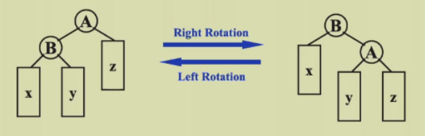

# ads

## week1

#### AVL Trees

1. target: speed up searching

2. tool: binary search trees

3. balanced trees: 

   - empty tree: height balanced, $h$ of $T$ is $-1$
   - no empty binary tree $T$: with $T_L$ and $T_R$
     - $T_L$ and $T_R$ are height balanced
     - $|h_L-h_R|\leqslant1$ where $h_L$ and $h_R$ are the heights of $h_L$ and $h_R$
     - hint: the balance factor $BF(node)=h_L-h_R$, in an AVL tree, $BF(node)=-1,0,or\space1$

4. **tree rotation!!!**

   

5. 

#### Splay Trees