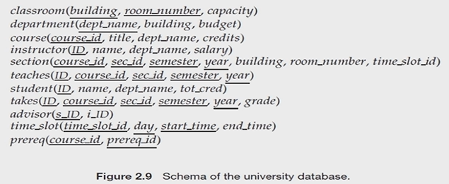
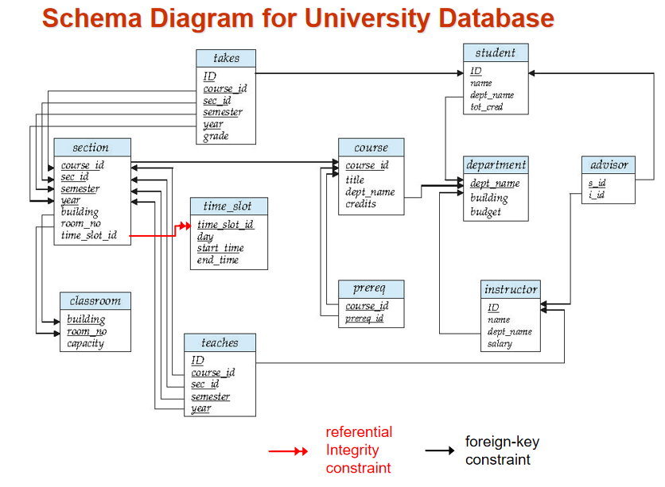
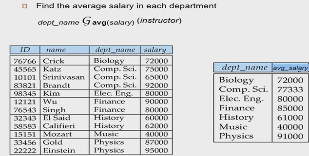
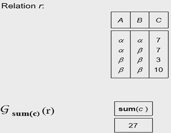

## the relational model(数据模型)

### 1. 关系模型例子：表格形式

| ID    | name | dept_name | salary |
| ----- | ---- | --------- | ------ |
| 12121 | Wu   | Finance   | 90000  |

- 列 $\rightarrow$ 属性
- 行 $\rightarrow$ 元组

### 2. 基本结构

- 关系 $R$ 的定义 
- $R=(A_1,A_2,...,A_n)$ is a relation scheme （模式）
- relations are unordered

### 3. Attributes

- domain, the set of allowed values for each attribute
- atomic, that is indivisible
- null, a member of every domain (special)

### 4. Keys

   Let K $\subseteq$ R

- K is a $superkey$ when K里的值足以确定R里的任何一个独一无二的元组
    - example : {ID} and {ID name} are both superkeys of instructor
- K is a $candidate\space key$ if K is min
    - example: {ID} is a candidate key for instructor
- one of the candidate keys is selected to be the $primary\space key$(主键)
- $foreign\space key$ : the attribute A of one relation $R1$ is the primary key of another relation $R2$ 
- referential integrity (参照完整性) ：范围比foreign key宽泛

### 5. An relation scheme database example

structure

relation diagram

### 6. relational query language

- $relational\space algebra$
- tuple relational calculus
- domain relational calculus

### 7. relation algebra

#### 7.1 6 basic operations

- select: $\sigma$   横向选择，选择条件满足的元组
- project: $\Pi$  纵向选择（投影）
- union: $\cup$  并起来
- set difference: $-$
- Cartesian product: $\times$
- rename: $\rho$   改表的名字  $\rho_X(E)$，把表E的名改为X

#### 7.2 other operations

- intersect: $R\cap S=R-(R-S)$  
- natural join : $r\bowtie s$  ，公共属性相同的行保留下来
- assignment: $\leftarrow$   ？
- outer join: r ⟕ s , r ⟖ s , r ⟗ s
- semijion join: r ⟖ $\theta$ s ,$\theta$ 为连接条件，只保留R内的属性，S起到一个筛选的作用
- division operator: $r\div s$

#### 7.3 Example Query:

- Find the names of all instructors in the Physics department, along with the course_id of all courses they have taught
    $$
    \Pi_{instructor.name,course\_id}(\sigma_{dept\_name="Physics"}(\sigma_{instructor.ID=teaches.ID}(instructor\times teaches)))
    $$
    
- Find the largest salary in the university

    - Step 1: find instructor salaries that are less than some other instructor salary (i.e. not maximum)
        $$
        \Pi_{instructor.salary}(\sigma_{instructor.salary<d.salary}(instructor\times \rho_d(instructor)))
        $$
        
    - Step 2: Find the largest salary
        $$
        \Pi_{salary}(instructor)-\Pi_{instructor.salary}(\sigma_{instructor.salary<d.salary}(instructor\times \rho_d(instructor)))
        $$

#### 7.4 Extended Relational-Algebra-Operations

- Generalized Projection

    - $\Pi_{ID,name,dept\_name,salary/12}(instructor)$

- Aggregate Function

    - avg,min,max,sum,count

    - Example 1: 

        

        Example 2: 

        

- delete

- insert

- update

### 8. Multiset

### 9. SQL and Relation Algebra

- `select A1,A2,...,An from r1,r2,...,rm where P`

    等价于  $\Pi_{A_1,...,A_n}(\sigma_P(r1\times r2\times ..\times rm))$

- `select A1,A2,sum(A3) from r1,r2,...,rm where P`

    等价于  $A1,A2,\mathcal{G}_{sum(A3)}(\sigma_P(r1\times r2\times ..\times rm))$